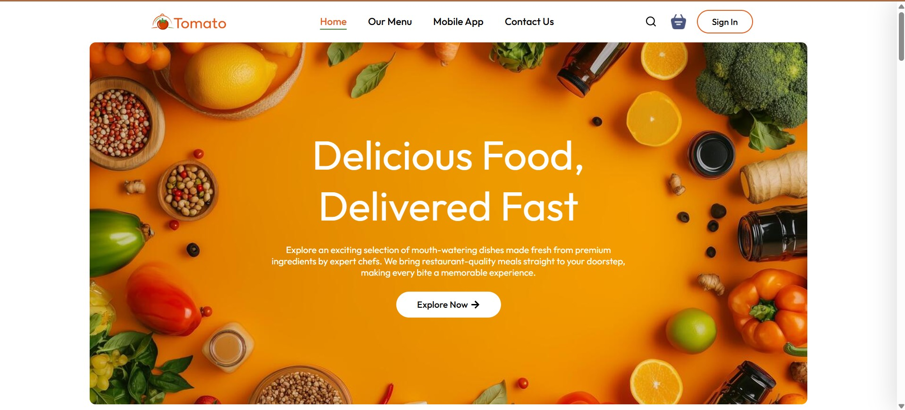

# 🍅 Tomato — Food Delivery Web Application

<div align="center">


**A modern, fully responsive food delivery web application built with React JS**

[](https://reactjs.org/)
[](https://vitejs.dev/)
[](https://reactrouter.com/)
[](https://developer.mozilla.org/en-US/docs/Web/CSS)

</div>

---

## 📌 Table of Contents

- [About the Project](#-about-the-project)
- [Features](#-features)
- [Tech Stack](#-tech-stack)
- [Project Structure](#-project-structure)
- [Pages & Components](#-pages--components)
- [State Management](#-state-management)
- [Authentication Flow](#-authentication-flow)
- [Responsive Design](#-responsive-design)
- [Getting Started](#-getting-started)
- [Available Scripts](#-available-scripts)
- [Dependencies](#-dependencies)
- [Development Journey](#-development-journey)
- [Future Enhancements](#-future-enhancements)
- [Acknowledgements](#-acknowledgements)

---

## 📖 About the Project

**Tomato** is a feature-rich food delivery web application developed entirely with **React JS**. The project was built to simulate a real-world food delivery platform, covering everything from browsing food categories and searching for dishes to adding items to a cart and proceeding through a checkout flow.

The application is built as a **multi-page single-page application (SPA)** using React Router DOM for client-side navigation, React Context API for global state management, and pure CSS3 for all styling and animations — with no external UI libraries used for layout or components.

Every page and component has been carefully designed to be **fully responsive** across all screen sizes, from small phones (320px) to large desktop monitors (1920px+).

---

## ✨ Features

### 🏠 Home Page

- Full-width hero banner with animated content overlay
- Explore Menu section with horizontally scrollable food category filter
- Food Display grid showing top dishes filtered by selected category
- Cart popup notification on adding any food item

### 📋 Menu Page

- Full food listing page with a dark-themed hero section and live search bar
- Sticky sidebar with all food categories, item counts, and active indicators
- Horizontal category strip for mobile devices
- Animated food grid with real-time filtering by category and search query
- Empty state UI when no results match the search
- Cart popup integrated from global context

### 🛒 Cart Page

- Displays all added food items with image, name, price, quantity, and total
- Responsive table layout that reflows on smaller screens using CSS Grid
- Empty cart state with a prompt to browse the menu
- Cart totals section showing subtotal, delivery fee ($25), and grand total
- Promo code input section
- Proceed to Checkout button navigating to the order page

### 📦 Place Order Page

- Delivery information form with fields for name, email, address, city, state, zip, and country
- Multi-field rows for first/last name and zip/state
- Responsive layout that stacks vertically on mobile
- Cart totals summary alongside the form

### 📱 App Download Page

- Section promoting the Tomato mobile app
- Play Store and App Store download buttons with icons

### 📞 Contact Us Page

- Dark-themed hero section with animated decorative rings and pulsing dots
- Three info cards for Phone, Email, and Location with react-icons
- Two-column layout with an aside section and a fully controlled contact form
- Animated input underline bars on focus
- Success state after form submission showing the user's name and email
- Social media links (Facebook, Twitter, Instagram)
- Google Maps embed styled with CSS filters to match the dark theme
- Fully responsive across all breakpoints

### 🔍 Live Search (Navbar)

- Search icon expands into an animated pill input on click
- Real-time filtering of food items by name and category
- Dropdown showing up to 7 results with image, name, category, and price
- Navigates to the Menu page on result click
- Empty state message when no results match
- Closes on outside click

### 🍔 Hamburger Menu (Mobile)

- Appears on screens below 768px replacing the desktop nav links
- Animated hamburger icon morphing into an X on open
- Slide-in drawer from the right with blurred overlay
- Contains full navigation links, search bar with live results, cart button, and Sign In button
- Body scroll locked while drawer is open

### 🔔 Cart Popup

- Appears at the bottom center of the screen when any food item is added
- Shows the item image, name, price, and a View Cart button
- Dismiss with the X button or navigate to cart via the button
- Powered entirely by global Context API state — works across all pages

### 🔐 Auth Guard

- Protected routes for `/cart` and `/order`
- Automatically shows the Login popup when an unauthenticated user tries to access these pages
- Redirects back to Home using React Router's `<Navigate>`
- Login and Register links in the Footer directly open the respective popup tab

---

## 📸 Screenshots

Get a glimpse of the Tomato food delivery app UI across different pages:

<br />

### 🏠 Home Page



<br />

### 📋 Menu Page


<br />

### 🛒 Cart Page


<br />

### 📞 Contact Us Page


---

## 🛠️ Tech Stack

| Technology           | Version  | Purpose                                     |
| -------------------- | -------- | ------------------------------------------- |
| **React JS**         | 18.x     | Core frontend framework                     |
| **Vite**             | 5.x      | Build tool and dev server                   |
| **React Router DOM** | 6.x      | Client-side routing and navigation          |
| **Context API**      | Built-in | Global state management                     |
| **React Icons**      | 5.x      | Icon components (Fi, Fa, Io, Bs)            |
| **CSS3**             | —        | All styling, animations, and responsiveness |

> ⚠️ No external UI libraries (Bootstrap, MUI, Tailwind) were used. All components are styled from scratch with pure CSS.

---

## 📁 Project Structure

```
food-delivery-app/
│
├── public/
│   └── vite.svg
│
├── src/
│   ├── assets/
│   │   ├── assets.js              → Exports all images, icons, menu_list, food_list
│   │   ├── logo.png
│   │   ├── banner-img.png
│   │   ├── menu_1.png – menu_8.png
│   │   ├── food_1.png – food_32.png
│   │   └── ... (all other icons and images)
│   │
│   ├── Components/
│   │   ├── Navbar/
│   │   │   ├── Navbar.jsx         → Sticky navbar, live search, hamburger, mobile drawer
│   │   │   └── Navbar.css
│   │   ├── Footer/
│   │   │   ├── Footer.jsx         → 4-column footer, social icons, quick links, contact
│   │   │   └── Footer.css
│   │   ├── Header/
│   │   │   ├── Header.jsx         → Home page hero banner with CTA button
│   │   │   └── Header.css
│   │   ├── ExploreMenu/
│   │   │   ├── ExploreMenu.jsx    → Horizontally scrollable category filter
│   │   │   └── ExploreMenu.css
│   │   ├── FoodDisplay/
│   │   │   ├── FoodDisplay.jsx    → Food grid filtered by category + cart popup
│   │   │   └── FoodDisplay.css
│   │   ├── FoodItems/
│   │   │   ├── FoodItems.jsx      → Individual food card with add/remove counter
│   │   │   └── FoodItems.css
│   │   ├── LoginPopup/
│   │   │   ├── LoginPopup.jsx     → Auth modal with Login and Sign Up tabs
│   │   │   └── LoginPopup.css
│   │   └── AppDownload/
│   │       ├── AppDownload.jsx    → App store download section
│   │       └── AppDownload.css
│   │
│   ├── Pages/
│   │   ├── Home/
│   │   │   ├── Home.jsx           → Landing page combining all home components
│   │   │   └── Home.css
│   │   ├── Menu/
│   │   │   ├── Menu.jsx           → Full menu page with sidebar, search, grid
│   │   │   └── Menu.css
│   │   ├── Cart/
│   │   │   ├── Cart.jsx           → Cart page with items table and totals
│   │   │   └── Cart.css
│   │   ├── Place-order/
│   │   │   ├── PlaceOrder.jsx     → Checkout page with delivery form
│   │   │   └── PlaceOrder.css
│   │   ├── Contact/
│   │   │   ├── ContactUs.jsx      → Contact page with form, map, info cards
│   │   │   └── ContactUs.css
│   │   └── AppDownload/
│   │       └── AppDownload.jsx    → App download standalone page
│   │
│   ├── Context/
│   │   └── StoredContext.jsx      → Global cart state, popup state, food list
│   │
│   ├── App.jsx                    → Root component, routes, auth guard, layout
│   ├── App.css                    → Global app styles
│   ├── main.jsx                   → React DOM entry point
│   └── index.css                  → Global CSS reset and base styles
│
├── index.html
├── vite.config.js
├── package.json
└── README.md

```

---

## 📄 Pages & Components

### `App.jsx`

The root component that holds all global state and renders the application shell.

- Manages `showLogin`, `authState`, and `isLoggedIn` states
- Implements `ProtectedRoute` using `useEffect` to avoid render-time state updates
- Renders `<Navbar>`, `<Routes>`, and `<Footer>` as the persistent layout
- `<Footer>` is placed outside `<div className="app">` to ensure full-width rendering

### `StoredContext.jsx`

The global state provider wrapping the entire app.

- `cartItems` — object mapping food item IDs to quantities
- `addToCart(itemId)` — adds item to cart and triggers the popup
- `removeFromCart(itemId)` — decrements item quantity
- `getTotalCartAmount()` — calculates the total price of all cart items
- `popupItem` — stores the last added food item for the popup
- `popupVisible` — boolean controlling popup visibility
- All values exposed via `StoreContext.Provider`

### `Navbar.jsx`

- Uses `useRef` for the search input focus and outside-click detection
- Uses `useEffect` to add and clean up the document click event listener
- Uses `useEffect` to lock body scroll when the mobile drawer is open
- `useNavigate` from React Router for programmatic navigation on search result click

### `FoodItems.jsx`

- Consumes `cartItems`, `addToCart`, `removeFromCart` from `StoreContext`
- Conditionally renders the add icon or the increment/decrement counter
- Calling `addToCart` automatically triggers the popup via context

### `ContactUs.jsx`

- Fully controlled form using `useState` for `formData` and `focused`
- `focused` state drives the animated label color and underline bar via CSS class toggling
- `submitted` state switches the form to a success state displaying user's name and email
- Does not use `useRef` since all form behaviour is driven by React state

---

## 🗂️ State Management

The application uses **React Context API** for global state — no Redux or external state library.

```
StoreContext
├── cartItems          → { [itemId]: quantity }
├── addToCart()        → adds item, triggers popup
├── removeFromCart()   → removes item
├── getTotalCartAmount() → computes total price
├── food_list          → full array of 32 food items
├── popupItem          → currently added food item object
├── popupVisible       → boolean for popup display
└── setPopupVisible    → manually close the popup
```

The popup state lives in context rather than in a component because `FoodDisplay` and `Menu` are both consumers of `StoreContext`. Placing popup state in a child component caused it to reset on every re-render triggered by `addToCart` updating `cartItems`. Moving it to the provider solved this entirely.

---

## 🔐 Authentication Flow

```
User clicks Cart or Order link
↓
ProtectedRoute checks isLoggedIn
↓
┌─────────────────────────────┐
│ isLoggedIn = false          │
│ useEffect → setShowLogin(true)│
│ <Navigate to="/" replace /> │
└─────────────────────────────┘
↓
LoginPopup appears on Home page
↓
User fills form and submits
↓
handleSubmit → setIsLoggedIn(true)
→ setShowLogin(false)
↓
User can now access /cart and /order
```

> Note: This is a frontend-only auth simulation. No backend or real authentication is implemented.

---

## 📱 Responsive Design

All pages and components are fully responsive with dedicated breakpoints:

| Breakpoint        | Target                       |
| ----------------- | ---------------------------- |
| `1400px+`         | Large desktop                |
| `1200px – 1399px` | Standard desktop             |
| `1024px – 1199px` | Small desktop / large laptop |
| `901px – 1023px`  | Tablet landscape             |
| `769px – 900px`   | Tablet portrait              |
| `601px – 768px`   | Large phone landscape        |
| `481px – 600px`   | Large phone portrait         |
| `391px – 480px`   | Standard phone               |
| `329px – 390px`   | Small phone                  |
| `< 328px`         | Very small phone             |

Key responsive techniques used:

- CSS Grid with `auto-fill` and `minmax()` for food item grids
- `clamp()` for fluid typography across all screen sizes
- `aspect-ratio` on food item images for consistent card heights
- `position: sticky` for the sidebar navigation
- `backdrop-filter: blur()` for the frosted glass navbar effect
- Horizontal scroll with hidden scrollbar for category strips
- CSS `data-label` attributes with `::before` for responsive cart table

---

## 🚀 Getting Started

### Prerequisites

Make sure you have the following installed:

- **Node.js** v18 or above
- **npm** v9 or above

### Installation

```bash
# 1. Clone the repository
git clone https://github.com/Yashtagad12/Food-Delivery-Web-App

# 2. Navigate into the project directory
cd food-delivery-app

# 3. Install all dependencies
npm install

# 4. Start the development server
npm run dev
```

The app will be available at `http://localhost:5173`

---

## 📜 Available Scripts

| Script            | Description                           |
| ----------------- | ------------------------------------- |
| `npm run dev`     | Starts the Vite development server    |
| `npm run build`   | Builds the app for production         |
| `npm run preview` | Previews the production build locally |
| `npm run lint`    | Runs ESLint for code quality checks   |

---

## 📦 Dependencies

```json
{
  "dependencies": {
    "react": "^18.x",
    "react-dom": "^18.x",
    "react-router-dom": "^6.x",
    "react-icons": "^5.x"
  },
  "devDependencies": {
    "@vitejs/plugin-react": "^5.x",
    "vite": "^5.x",
    "eslint": "^8.x"
  }
}
```

---

## 🛤️ Development Journey

This project was developed iteratively, with each feature building on the previous:

1. **Project Setup** — Initialized with Vite + React, configured React Router DOM and folder structure
2. **Assets & Data** — Set up `assets.js` with all food items (32 dishes across 8 categories) with unique descriptions
3. **Core Components** — Built Header, ExploreMenu, FoodItems, FoodDisplay with category filtering
4. **Context API** — Implemented StoreContext for cart management across all pages
5. **Navbar** — Built sticky glass navbar with live search dropdown, hamburger menu, and mobile drawer
6. **Footer** — Built 4-column footer with React Icons, dynamic year, and quick links
7. **Menu Page** — Full menu page with dark hero, sticky sidebar, category strip, and search
8. **Cart Page** — Cart table with responsive reflow, empty state, totals, and promo code
9. **Place Order Page** — Delivery form with responsive multi-field layout
10. **Contact Us Page** — Dark themed page with animated form, info cards, and map embed
11. **Cart Popup** — Moved popup state to Context to survive re-renders across all pages
12. **Auth Guard** — Protected routes with `useEffect`-based login trigger
13. **Responsive Polish** — Applied `clamp()`, `aspect-ratio`, custom breakpoints on all components
14. **React Icons Migration** — Replaced all `` icon tags with React Icons components

---

## 🔮 Future Enhancements

- [ ] Backend integration with Node.js and Express
- [ ] MongoDB database for real food and user data
- [ ] JWT-based real authentication with token storage
- [ ] User profile page with order history
- [ ] Real promo code validation system
- [ ] Payment gateway integration (Razorpay / Stripe)
- [ ] Order tracking with real-time status updates
- [ ] Admin dashboard for managing food items and orders
- [ ] PWA support for installable mobile experience
- [ ] Dark mode toggle across the entire app

---

## 🙌 Acknowledgements

- Food images and design inspiration from various food delivery platforms
- Icons provided by [React Icons](https://react-icons.github.io/react-icons/)
- Built and developed with guidance and iterative improvements throughout the development process

---

## 📃 License

This project is open source and available under the [MIT License](LICENSE).

---

<div align="center">

**Built with ❤️ using React JS**

_🍅 Tomato — Delicious Food, Delivered Fast_

</div>
